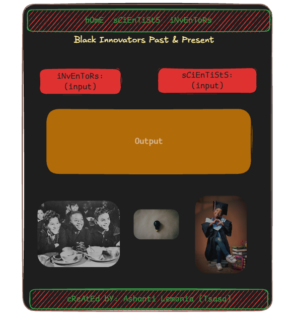

## Data 
dataset African American Inventors and Scientists

### Data fields

|id|Name|Date of birth|death| Occupation(s)| Inventions/accomplishment|
| --- | --- | --- | --- | ---| -- |
| 24 | Brady, St. Elmo | 1884–1966 | Chemist | Published three scholarly abstracts in Science | collaborated on a paper published in the Journal of Industrial and Engineering Chemistry|

## The plan

### Sections

A visitor will see a button to click for a scientists.

A visitor will see a button to click for black inventors.

### User Input

A visitor types a question to look for and the page shows the name of the scientists or inventor

A visitor clicks search and the page displays who did what.

### Output
Fields will show:
id, Name, Date of birth/death, Occupation(s), Inventions/accomplishments.

## The Problem
1. Unable to find information about black scientists and inventors.
2. Give more accurate information on bios, timelines, and inventions.
3. Help younger generations to identify with their true history and have more self confidence.

## My Team
Accountability Partners
1. @BabySodaCodex
2. @LanetteBethea
3. @Danielle Everson-Riley